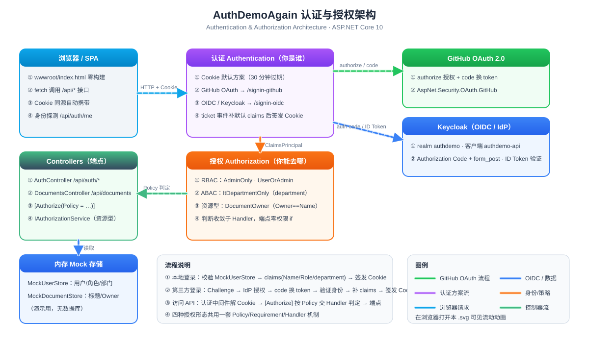

# AuthDemoAgain

> 本分支是 [AuthDemo](https://github.com/fangqiank/AuthDemo/tree/main)（分层架构版）的迭代演示：在同一套 ASP.NET Core 10 Web API 里并排演示多种认证方式与授权形态。



（GitHub 静态渲染 SVG，动画请下载后用浏览器打开）

## 功能矩阵

| 认证方式 | 入口 | 说明 |
|---|---|---|
| 本地账号 + Cookie | `POST /api/auth/login` | Cookie 30 分钟过期，claims：Name / Role / department |
| GitHub OAuth 2.0 | `GET /api/auth/github-login` | `AspNet.Security.OAuth.GitHub`，回调 `/signin-github` |
| OIDC（Keycloak） | `GET /api/auth/oidc-login` | Authorization Code + form_post，回调 `/signin-oidc`，ID Token 验证 |

| 授权形态 | Policy | 判定依据 |
|---|---|---|
| RBAC | `AdminOnly` / `UserOrAdmin` | Role claim |
| ABAC | `ItDepartmentOnly` | department claim（`DepartmentRequirement` + Handler） |
| 资源型 | `DocumentOwner` | `IAuthorizationService.AuthorizeAsync(User, resource, …)`，Owner==当前用户 |

原则：权限判断收敛在 Policy/Handler，端点只写 `[Authorize(Policy = …)]` 声明，零 `if (user.role == …)`。

## 测试账号

| 账号 | 密码 | 角色 | 部门 | 登录方式 |
|---|---|---|---|---|
| admin | admin123 | Admin | IT | 本地 |
| user | user123 | User | Sales | 本地 |
| demo | demo123 | User（默认） | General | Keycloak OIDC |

## 运行

```powershell
dotnet run --project AuthDemoAgain        # https://localhost:7035 首页即 SPA 操作台
```

第三方登录需先配置凭据（缺失则启动失败并提示）：

```powershell
dotnet user-secrets set "GitHub:ClientId" "<id>"
dotnet user-secrets set "GitHub:ClientSecret" "<secret>"
dotnet user-secrets set "Keycloak:Authority" "http://<your-keycloak-host>:8080/realms/authdemo"
dotnet user-secrets set "Keycloak:ClientId" "authdemo-api"
dotnet user-secrets set "Keycloak:ClientSecret" "<secret>"
```

GitHub OAuth App 回调 URL：`https://localhost:7035/signin-github`；Keycloak 客户端回调：`https://localhost:7035/signin-oidc`。

## 核心概念速查

> 本 demo 实际覆盖：Session 型 Cookie 认证、RBAC + ABAC（+ 资源型）授权、OAuth 2.0 / OIDC 协议、Challenge 机制。其余为选型知识。

### 认证 (Authentication)

- **Session**：适合单体应用。服务端控制（存 Redis），可随时注销，改权限立即生效。缺点是依赖中央存储，扩展受限。
- **JWT**：适合微服务。无状态，签名防篡改（信息是公开的，不是加密的）。优点是服务端无需查库，利于扩容；缺点是无法主动失效（需配合短过期 + Refresh Token，或黑名单），且严禁将敏感权限（如 `role=admin`）放进 Payload 明文。

### 鉴权 (Authorization)

- **RBAC（基于角色）**：最通用、最直接。角色加在用户和权限之间，适合绝大部分业务系统（改角色即改权限）。
- **ABAC（基于属性）**：粒度最细，看环境、资源属性（如"只能看自己部门的订单"）。缺点是规则复杂，排查和审计极难，除非真需要复杂资源级控制，否则不要轻易上。
- **ACL（访问控制列表）**：直接挂在资源上（如文件系统、云存储桶）。适合资源少、用户少但每个资源权限都不同的场景。管理成本高。

### 协议与工具

- **OAuth 2.0 是授权**（委托第三方访问），**OIDC 是认证**（IdP 向应用证明"你是谁"）。不要混淆。
- OAuth 2.0 模式：有用户/有浏览器用 **Authorization Code**（最安全）；纯服务间用 **Client Credentials**；Implicit 和 Password 已废弃。
- 工具：在云端用云厂商 IAM；开源自建选 **Keycloak**，不要自己造轮子。

### Challenge 怎么理解

Challenge = 「你还没出示证件，去出示」这个动作。词源是 HTTP 早期模型：服务端返回 401 + `WWW-Authenticate: Basic`，即"发起质询"。ASP.NET Core 把它推广成每个认证方案的四种操作之一：

| 操作 | 含义 | 触发时机 |
|---|---|---|
| `Authenticate` | 检查已带的证件（读 Cookie 解析 claims） | 每个请求 |
| `Challenge` | 要求去取证件（对浏览器 = 302 重定向到登录处） | 未认证就访问受保护资源 |
| `Forbid` | 证件有了但级别不够 → 403 | 已认证但不满足 Policy |
| `SignOut` | 销毁证件 | logout |

对浏览器交互式方案，Challenge 的实体就是一个 302，跳到哪个方案就跳谁的家：Cookie 方案 → `LoginPath`；GitHub 方案 → `github.com/login/oauth/authorize`；OIDC 方案 → Keycloak `/protocol/openid-connect/auth`。

触发有两个入口：**显式**——`oidc-login` 端点里手动 `Challenge(方案名)`；**隐式**——未认证直接访问 `[Authorize]` 端点，框架按 `DefaultChallengeScheme`（本项目 = GitHub）自动 Challenge，这就是为什么裸访问 `/profile` 会跳 GitHub。

Challenge 之后 OIDC 方案独有的一段：Keycloak 不直接给 token，而是给一次性 code（form_post 送回 `/signin-oidc`）→ 服务端用 code + client_secret 换 token → 验证 ID Token 的签名/issuer/audience（这一步是 OIDC 区别于 OAuth 2.0 的核心：证明"你是谁"的是这个 JWT）→ `OnTokenValidated` 补 claims → 签发自家 Cookie。之后所有请求靠 Cookie 自证，不再回 Keycloak。

### 终极原则

不要在代码里散落 `if (user.role == 'admin')`，权限判断应收敛到中间件、网关或策略引擎统一处理。本 demo 的做法：**声明可以散落（`[Authorize(Policy = …)]`），判断必须收敛（Policy + Handler）**。

## 免责

仅供教学演示：用户存内存 `MockUserStore`、密码明文、无 HTTPS 强化、无速率限制——勿用于生产。
