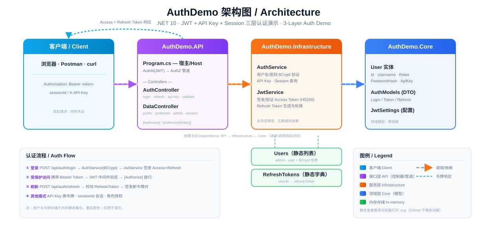

# AuthDemo

> 一个基于 **.NET 10 / ASP.NET Core** 的**身份认证（Authentication）演示项目**，集中展示 JWT、API Key、Session、角色授权等多种认证与授权模式。采用三层（Clean Architecture 风格）分层，所有数据存于内存，开箱即跑、便于学习。

  

---

## 架构 / Architecture



> 💡 在浏览器中直接打开 `authdemo-architecture.svg` 可查看流动动画（GitHub 仅静态渲染 SVG）。

三层依赖，单向流动：**`AuthDemo.API` → `AuthDemo.Infrastructure` → `AuthDemo.Core`**

| 项目 | 职责 | 关键内容 |
|---|---|---|
| **AuthDemo.Core** | 领域模型，零依赖 | `User` 实体、`AuthModels`(DTO)、`JwtSettings`(配置) |
| **AuthDemo.Infrastructure** | 业务服务 | `AuthService`(用户/API Key 验证)、`JwtService`(令牌签发/验证/刷新) |
| **AuthDemo.API** | Web 宿主 + 控制器 | `Program.cs`(JWT 管道)、`AuthController`、`DataController` |

---

## 认证知识体系 / Authentication Concepts

> 以下为本项目演示所涉及的核心认证概念梳理。

### 1. 身份认证的本质

- **定义**：回答“用户是谁”的问题——验证请求者（用户或服务）的身份是否属实。
- **与授权的区别**：认证是**第一步**（确认身份），授权是**下一步**（决定能做什么）。本项目同时演示二者：登录即认证，`[Authorize(Roles)]` 即授权。

### 2. 常见认证方法（按演进顺序）

| 方法 | 特点 | 缺陷 / 现状 | 本项目对应 |
|---|---|---|---|
| **Basic 认证** | 用户名密码经 Base64 编码后放在请求头 | 极不安全（可逆），现已很少用，除非配合 HTTPS | — |
| **Digest 认证** | 使用 MD5 哈希替代明文密码 | 比 Basic 稍好，但仍过时，极少使用 | — |
| **API Key** | 服务端生成唯一随机字符串，客户端每次请求携带 | 无内建过期机制，泄露风险高；需查存储验证 | `POST /api/auth/api-key`、`GET /api/data/api-key-data` |
| **Session 认证** | 登录后服务端存储会话（如 Redis），客户端存 Cookie | 有状态，适合传统 Web 应用，但分布式扩展困难 | `GET /api/data/session`（`sessionId` 头） |
| **Token 认证（JWT）** | 客户端持有自包含的 JSON Web Token，含用户信息及签名 | 无状态、可扩展，是现代 API 常用方式 | `POST /api/auth/login` + `[Authorize]` 端点 |

### 3. 关于 Token 的细节

- **Bearer Token**：一种“持有即有权”（持有即可访问）的模式，**不是**具体的认证方法，而是令牌的传递方式。
- **JWT**：最常见的 Bearer Token 格式；签名后可**本地验证**（无需查数据库），承载用户信息。它本身是“令牌格式”，不是认证方法。
- **Access Token + Refresh Token**：
  - **Access Token** 短期有效（本项目 15 分钟），用于 API 调用。
  - **Refresh Token** 长期有效（本项目 7 天），用于获取新的 Access Token。
  - 建议将 Refresh Token 存于 **HTTP-only Cookie** 以防 XSS 攻击。
  - ⚠️ 注意：JWT 的“无需查数据库”仅对**签名/有效期**验证成立；**令牌吊销（Revocation）**仍需服务端记录（这正是 Refresh Token 轮换 + 黑名单机制存在的原因）。

### 4. 易混淆概念澄清

| 概念 | 实际类型 | 作用 |
|---|---|---|
| **JWT** | 令牌格式（Token Format） | 承载用户信息，不是认证方法 |
| **Bearer Authentication** | 令牌传递模式 | 描述“谁持有谁访问”，不是具体方法 |
| **OAuth 2** | 授权框架（Authorization Framework） | 允许应用代表用户访问资源，**不负责**认证用户身份 |
| **OpenID Connect** | 基于 OAuth 2 的认证层 | 在 OAuth 2 基础上增加 **ID Token**，提供用户身份信息 |
| **单点登录（SSO）** | 用户体验模式（UX Pattern） | 一次登录，访问多个服务，不是认证方法本身 |

### 5. 身份协议（用于 SSO）

- **SAML**：基于 XML 的旧式协议，常用于企业级系统（如 Salesforce）。
- **OpenID Connect**：基于 JSON/JWT 的现代协议，被 Google 等广泛使用。

---

## 端点与认证模式映射 / Endpoints

| 认证模式 | 方法 & 端点 | 鉴权要求 |
|---|---|---|
| 公开 | `GET /api/data/public` | 无 |
| JWT 登录 | `POST /api/auth/login` | 无（换取令牌） |
| 刷新令牌 | `POST /api/auth/refresh` | Body 携带 `refreshToken` |
| 验证令牌/查看声明 | `GET /api/auth/validate` | `[Authorize]`（Bearer） |
| 登出 | `POST /api/auth/logout` | `[Authorize]` |
| API Key 换令牌 | `POST /api/auth/api-key` | Body 携带 `apiKey` |
| 受保护数据 | `GET /api/data/protected` | `[Authorize]` |
| 管理员数据 | `GET /api/data/admin-only` | `[Authorize(Roles="Admin")]` |
| 会话数据 | `GET /api/data/session` | 请求头 `sessionId` |
| API Key 数据 | `GET /api/data/api-key-data` | 请求头 `X-API-Key` |

---

## 快速开始 / Getting Started

### 前置要求

- [.NET SDK 10.0.x](https://dotnet.microsoft.com/download)

### 构建与运行

```bash
dotnet build AuthDemo.slnx
dotnet run --project AuthDemo.API
```

运行后访问（见 `launchSettings.json`）：
- HTTP：`http://localhost:5174`
- HTTPS：`https://localhost:7297`

API 文档（开发环境）：`/scalar/v1`（Scalar）；OpenAPI 文档：`/openapi/v1.json`。

### 演示账号 / Demo Credentials

| 用户名 | 密码 | 角色 | API Key |
|---|---|---|---|
| `admin` | `admin123` | `Admin`, `User` | `demo-api-key-12345` |
| `user` | `user123` | `User` | `demo-api-key-67890` |

---

## 典型调用流程 / Example Flows

```bash
# ① 登录，获取 Access + Refresh Token
TOKEN=$(curl -s -X POST http://localhost:5174/api/auth/login \
  -H "Content-Type: application/json" \
  -d '{"username":"admin","password":"admin123"}' | jq -r .accessToken)

# ② 携带 Bearer Token 访问受保护端点
curl http://localhost:5174/api/data/protected -H "Authorization: Bearer $TOKEN"

# ③ 管理员专属端点
curl http://localhost:5174/api/data/admin-only -H "Authorization: Bearer $TOKEN"

# ④ 会话认证（sessionId 作为请求头）
curl http://localhost:5174/api/data/session -H "sessionId: session_123456"

# ⑤ API Key 数据（X-API-Key 作为请求头）
curl http://localhost:5174/api/data/api-key-data -H "X-API-Key: demo-api-key-12345"
```

---

## 实现说明与已知限制 / Notes & Limitations

- **仅用于演示**：用户数据与令牌均存于**内存静态集合**（`AuthService.Users`、`JwtService.RefreshTokens`），应用重启即丢失，**无任何数据库**。
- **演示用密钥**：JWT `SecretKey` 在 `Program.cs` 与 `appsettings.json` 中硬编码为占位值（`your-super-secret-key...`），**严禁用于生产**。生产环境应改用安全密钥管理（如 Azure Key Vault / 环境变量）并从配置绑定读取。
- **Refresh Token 轮换**：登录时签发的 Refresh Token 会持久化到 `JwtService.RefreshTokens`，`/api/auth/refresh` 据此校验并签发新令牌对。⚠️ 已知简化：`RefreshTokenAsync` 在轮换时固定返回 `demo_user`（Id=1）身份，而非映射回原始用户——因此 `admin`（同为 Id=1）可正常刷新，而 `user`（Id=2）刷新后会得到 demo 用户身份的令牌。
- **密码哈希**：使用 [BCrypt.Net-Next](https://github.com/BcryptNet/bcrypt.net)。
- **未使用依赖**：`StackExchange.Redis` 已在 `AuthDemo.API.csproj` 中引用但暂未使用，预留给后续 Session/Token 存储。
- **API 文档**：使用 [Scalar](https://github.com/scalar/scalar) 而非 Swagger UI；根路径 `/` 重定向至 `/swagger`（与 Scalar 实际路径不一致，属已知小问题）。
- **CORS**：`Program.cs` 已配置宽松策略 `AllowAll`（任意 Origin/Method/Header），并在请求管道中 `UseCors` 置于认证之前——支持浏览器跨域调用并正确响应预检 `OPTIONS` 请求（否则会返回 405）。中间件顺序：`HttpsRedirection → UseCors → Authentication → Authorization → MapControllers`。生产环境应收紧为白名单来源。

---

## 项目结构 / Project Structure

```
AuthDemo/
├── AuthDemo.slnx                  # 新版 XML 解决方案
├── authdemo-architecture.svg      # 架构图（动画）
├── AuthDemo.Core/                 # 领域模型（零依赖）
│   └── Models/ (User, AuthModels, JwtSettings)
├── AuthDemo.Infrastructure/       # 认证服务
│   └── Services/ (AuthService, JwtService + 接口)
└── AuthDemo.API/                  # Web 宿主 + 控制器
    ├── Program.cs                 # JWT 中间件管道配置
    └── Controllers/ (AuthController, DataController)
```

---

> ⚠️ **免责声明**：本项目为教学演示，包含硬编码的占位密钥与演示凭证，**不可直接用于生产环境**。
